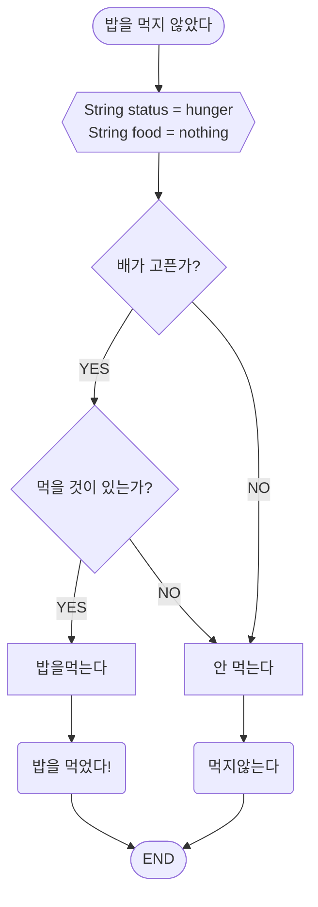

#hello

```mermaid
flowchart TB
A([밥을 먹지 않았다]) 
B{{String status = hunger\n String food = nothing}} 
C{배가 고픈가?}
D{먹을 것이 있는가?}
E[밥을먹는다]
F(밥을 먹었다!)
G([END])
H[안 먹는다]
I(먹지않는다)

A --> B --> C -->|YES| D -->|YES| E --> F --> G

C --> |NO| H
D --> |NO| H
H --> I
I --> G
```

    

